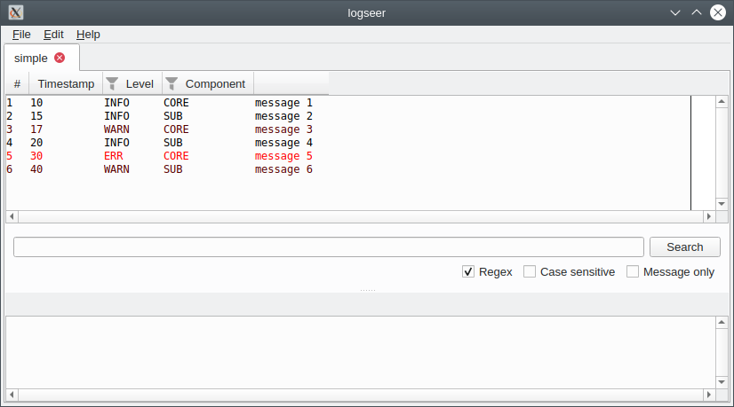

# logseer

**logseer** is a column-based indexing log viewer. It is a cross-platform clone of [LogGrok](https://github.com/pekabon/LogGrok).

Some prominent features:
* Support for custom column-based log formats.
* Ability to mark columns as indexed to enable fast filtering.
* Large files support.
* Linux and Windows support.
* Unicode support.

The latest windows binaries are available [here](https://github.com/nongeneric/logseer/releases).

Filtering:

## Building on Fedora

Install the dependencies

    $ dnf install git gcc-c++ cmake boost-devel qt5-devel spdlog-devel libfmt-devel ninja-build

Clone the repository recursively

    $ git clone --recurse-submodules https://github.com/nongeneric/logseer.git

Configure and build

    $ mkdir /path/to/build-dir
    $ cd /path/to/build-dir
    $ cmake /path/to/repo
    $ make
    $ make install

To cross-compile for windows you need MinGW

    $ dnf install mingw64-gcc-c++ mingw64-boost mingw64-qt5-qtbase-devel

Now configure and build

    $ mingw64-cmake \
        -D CMAKE_CXX_IMPLICIT_INCLUDE_DIRECTORIES="/usr/x86_64-w64-mingw32/sys-root/mingw/include" \
        .
    $ make package

## General settings

The config is stored in the home directory ``~/.logseer/logseer.json``. It is created on startup if it doesn't exist.

    {
        "font": {
            "name": "Mono",
            "size": 10
        },
        "search": {
            "caseSensitive": false,
            "messageOnly": false,
            "regex": false
        }
    }

**font.name** is the font name used for the log text.

**font.size** is the font size in points.

**search.\*** are the search settings. They are updated at runtime by **logseer**.

## Regex parsers

It is possible to extend **logseer** via format description files stored in the ``~/.logseer/regex/`` directory.

Each file name needs to have the following format ``<priority>_<name>.json``, e.g. ``100_simple.json``. When **logseer** opens a log file it tries each ``json`` in succession according to its priority, with ``0`` being the highest priority.

Let's take this simple log as an example

    10 INFO CORE message 1
    15 INFO SUB message 2
    17 WARN CORE message 3
    20 INFO SUB message 4
    30 ERR CORE message 5
    40 WARN SUB message 6

Its format can be described with the following ``json`` format specification

    {
        "description": "test description",
        "regex": "(\\d+) (.*?) (.*?) (.*)",
        "columns": [
            {
                "name": "Timestamp",
                "group": 1,
                "indexed": false
            },
            {
                "name": "Level",
                "group": 2,
                "indexed": true
            },
            {
                "name": "Component",
                "group": 3,
                "indexed": true
            },
            {
                "name": "Message",
                "group": 4,
                "indexed": false
            }
        ],
        "colors": [
            {
                "column": "Level",
                "value": "ERR",
                "color": "ff0000"
            },
            {
                "column": "Level",
                "value": "WARN",
                "color": "aa0000"
            }
        ]
    }

**description** is the log format description. It is unused for now.

**regex** specifies a pattern that extracts the columns from a text line. It needs to produce a set of regex groups that will then be treated as columns. There might be unused groups.

**magic** (not shown) is the first few characters of the log file, used to select the appropriate log format when opening new files. If not specified, **logseer** will attempt to parse the first few lines of the log file with different parsers and select the first one that doesn't err.

**columns** is an array that provides descriptions for columns, extracted using the **regex** property.

**columns.name** is the header of the column, as it appears in the UI.

**columns.group** is the index of the regex group that provides the value for this column. Indexes start from 1.

**columns.indexed** is a boolean indicating that the column should allow filtering. It makes sense to mark as indexed columns with a small range of possible values.

**colors** is an array of predicates that allow changing line colors in the UI. When selecting the line color, **logseer** evaluates the predicates in order, until the first match (if any).

**colors.column** is the name of the column for which the color applies.

**colors.value** is the expected value of the column.

**colors.color** is an RGB hex value of the color.

## Keyboard shortcuts

Key | Action
--- | ---
F5 | Reload.
Ctrl+1..9 | Edit the filter of the corresponding indexed column.
Home | Go to the beginning of the log.
End | Go to the end of the log.
Ctrl+F | Focus the search line (then ENTER to search).
Ctrl+Tab | Switch to the next tab.
Ctrl+Shift+Tab | Switch to the previous tab.
Ctrl+W | Close the current tab.
Ctrl+R | Clear all filters.
Ctrl+C | Copy selected lines.
Ctrl+Shift+C | Copy selected lines (with headers and spaces).
